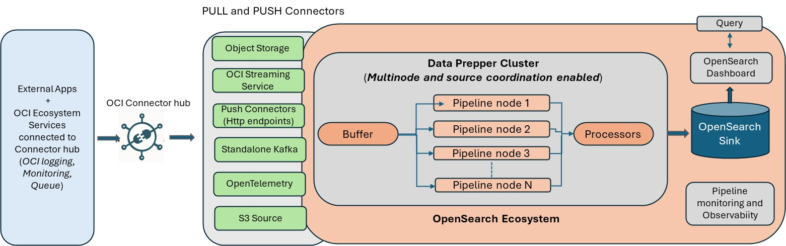

Oracle has anounced the support of opensearch 2.19 in OCI

<!-- truncate -->

Oracle has released opensearch v2.19 in OCI.

Various new features are now avilable.

[Read here](https://blogs.oracle.com/cloud-infrastructure/post/oci-search-support-to-opensearch-v219)